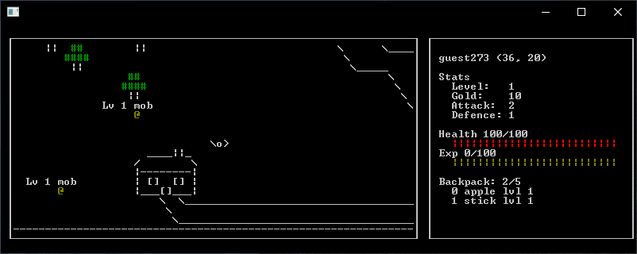

<!-- cSpell:ignoreRegExp \[`.*`\] -->
<!-- cSpell:words Boxplots CogMind Diablo Dungeonuary -->

# tui-game-inspo

_TUI_, or text-based UI, game development inspiration.

> ❕ All of the games and apps listed here are either open source or the
> screenshots are from their original website. I don't own any of them!

## Apps

### [`bashtop`](https://github.com/aristocratos/bashtop)

### [`glow`](https://github.com/charmbracelet/glow)

## Games

### [Ancient Domains of Mystery](https://www.linuxlinks.com/Ancient-Domains-of-Mystery/)

### [AsciiSector](https://www.linuxlinks.com/AsciiSector/)

### [Cataclysm: Dark Days Ahead](https://cataclysmdda.org/)

### [Cogmind](https://store.steampowered.com/app/722730/Cogmind/)

### [DiabloRL](https://diablo.chaosforge.org/)

### [Dwarf Fortress](http://www.bay12games.com/dwarves/)

### [Operation: Overkill II](https://www.pcmag.com/news/the-forgotten-world-of-bbs-door-games)

### [Sanctuary RPG](http://www.sanctuaryrpg.com)

### [`angband`](https://github.com/angband/angband)

### [`asciinem`](https://github.com/hjaremko/asciinem)

### [`botany`](https://github.com/jifunks/botany/)

### [`clidle`](https://github.com/ajeetdsouza/clidle)

### [`curseofwar`](https://github.com/a-nikolaev/curseofwar/)

### [`flapioca`](https://github.com/kbrgl/flapioca)

### [`hauberk`](https://github.com/munificent/hauberk)

### [`lots`](https://github.com/sourcerer-io/lots)

### [`nethack`](https://github.com/NetHack/NetHack)

### [`pokete`](https://github.com/lxgr-linux/pokete)

### [`terminal-rpg-ruby](https://github.com/mishalzaman/terminal-rpg-ruby)

## Other

### [Dungeonuary](https://itch.io/jam/dungeonuary)

### [`cursive`](https://github.com/gyscos/cursive)

### [`pyxel`](https://github.com/kitao/pyxel)

### [`Terminal.Gui`](https://github.com/gui-cs/Terminal.Gui)

## Tutorials

### [ASCII Boxplots](https://arthur.maheo.net/ascii-boxplots/)

### [Creating a Text-based UI with Rust](https://dev.to/protium/creating-a-text-based-ui-with-rust-420)

